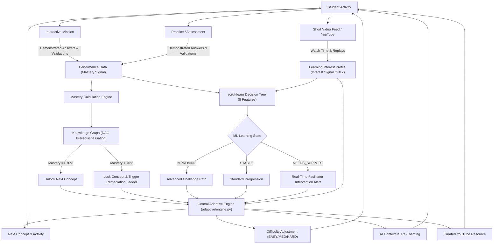

# AdaptiveLearn AI

> **“One platform. Shared knowledge. Personalized learning. Connected learners.”**

AdaptiveLearn AI is a production-grade, full-stack **Adaptive Learning & Real-Time Intervention Platform** built for Grade 10, PUC, Diploma, ITI, and Professional Skill learners.

It replaces static course catalogs and generic LMS dashboards with a **continuous closed-loop pedagogical engine** that adapts learning paths, difficulty, practice, missions, video recommendations, and facilitator interventions in real time based on demonstrated mastery and behavioral signals.

---

## 📑 Table of Contents

1. [Core Innovation & Problem Solved](#-core-innovation--problem-solved)
2. [End-to-End Pedagogical Loop](#-end-to-end-pedagogical-loop)
3. [Architecture & Technical Stack](#-architecture--technical-stack)
4. [Key Features & Pedagogical Innovations](#-key-features--pedagogical-innovations)
   - [Knowledge Graph & 70% Mastery Gating](#1-knowledge-graph--70-mastery-gating)
   - [Interactive Academic Learning Missions](#2-interactive-academic-learning-missions)
   - [scikit-learn Decision Tree ML State](#3-scikit-learn-decision-tree-ml-state)
   - [Real-Time Facilitator Interventions](#4-real-time-facilitator-interventions)
   - [AI Contextual Re-Theming](#5-ai-contextual-re-theming)
   - [Separation of Video Engagement & Mastery](#6-separation-of-video-engagement--mastery)
   - [“Where Am I Stuck?” Diagnostic Recovery Ladder](#7-where-am-i-stuck-diagnostic-recovery-ladder)
   - [Adaptive Timetable: "My Adaptive Day"](#8-adaptive-timetable-my-adaptive-day)
   - [Multilingual AI Translation](#9-multilingual-ai-translation)
   - [Connected Learners Community & Projects](#10-connected-learners-community--projects)
5. [The Required Two-Student Demo (Rahul vs. Priya)](#-the-required-two-student-demo-rahul-vs-priya)
6. [Demo Accounts & 1-Click Persona Switcher](#-demo-accounts--1-click-persona-switcher)
7. [Installation & Setup](#-installation--setup)
8. [Environment Configuration (.env)](#-environment-configuration-env)
9. [REST API Documentation](#-rest-api-documentation)
10. [Security & Error Handling](#-security--error-handling)

---

## 💡 Core Innovation & Problem Solved

Traditional online learning platforms treat all students identically:
* Students watch videos passively $\rightarrow$ marked "complete" without true comprehension.
* Advanced students are held back by rigid curricula; struggling students fail silently without human intervention.
* Word problems use generic, uninspiring contexts disconnected from student passions.

**AdaptiveLearn AI solves this through 4 fundamental breakthroughs:**
1. **Engagement $\ne$ Mastery**: Video watch time builds a **Learning Interest Profile**; only verified performance on practice, assessments, and missions unlocks academic mastery.
2. **Prerequisite Gating (70% Threshold)**: Downstream concepts remain strictly locked until prerequisites are proven.
3. **Interactive Academic Missions**: Students learn by doing (e.g. *Save the Space Station*, *Build a Sustainable Ecosystem*, *Repair the Robot*, *Land the Spacecraft*) with automatic step-by-step parameter validation.
4. **Machine Learning State & Real-Time Facilitator Alerts**: An 8-feature scikit-learn Decision Tree identifies declining learners (`NEEDS_SUPPORT`) and dispatches actionable remediation prescriptions directly to teachers.

---

## 🔄 End-to-End Pedagogical Loop



---

## 🛠 Architecture & Technical Stack

The application is built strictly using the hackathon stack:

* **Frontend**: HTML5, Vanilla CSS3 (Custom Glassmorphism Design System), Vanilla JavaScript (No React/Vue/Node.js), Chart.js.
* **Backend**: Python 3.10+, Flask, Flask REST APIs, Session-based role authentication.
* **Database**: MySQL with **automated zero-config fallback to SQLite** (`database/adaptivelearn.db`) if MySQL daemon is not running on localhost:3306.
* **Machine Learning**: Python, `scikit-learn` (`DecisionTreeClassifier` model saved via `joblib`), `numpy`.
* **AI Engine**: Google Gemini API via official `google-genai` SDK backend-only, with full deterministic **Demo Mode** parity when API keys are absent.

```
adaptivelearn-ai/
├── app.py                      # Flask Application Entrypoint & Route Registrations
├── config.py                   # Centralized Configuration & Environment Loading
├── requirements.txt            # Python Dependencies
├── .env.example                # Template Environment Variables
├── database/
│   ├── schema.sql              # Production 48-table MySQL Schema
│   ├── seed.sql                # Realistic 5-Student & Facilitator Seed Data
│   └── db.py                   # Dual-Engine Database Manager (MySQL / SQLite)
├── models/                     # Data Access Models (User, Student, Course, Mastery, etc.)
├── adaptive/
│   ├── engine.py               # Central Adaptive Learning Decision Engine
│   ├── mastery.py              # Mathematical Mastery Calculation
│   ├── knowledge_graph.py      # DAG Prerequisite Resolver & Visual Statuses
│   └── difficulty.py           # 5-Step Remediation Ladder & Scaling
├── ai/
│   ├── retheme.py              # Contextual Re-Theming Preserving Equations
│   ├── tutor.py                # Pedagogical AI Assistant (Hint-Scaffolded)
│   ├── translation.py          # Multilingual Translation Engine
│   ├── career.py               # Skill & Interest Pathway Exploration
│   └── intervention.py         # Automated Actionable Teacher Interventions
├── ml/
│   ├── features.py             # 8-Dimensional Cognitive Feature Extractor
│   ├── model.py                # scikit-learn Decision Tree Trainer & Persister
│   └── predictor.py            # Live Evaluation & Prediction Logging
├── services/
│   ├── youtube_service.py      # YouTube Data API v3 & Curated Fallbacks
│   ├── interest_service.py     # Multi-Signal Interest Graph Calculator
│   ├── timetable_service.py    # "My Adaptive Day" Dynamic Scheduler
│   └── mission_service.py      # Interactive Mission Step-by-Step Validator
├── routes/                     # 13 REST API Blueprints
├── templates/                  # 22 Vanilla HTML5 Templates
├── static/                     # CSS, Vanilla JS, and Visual Assets
└── docs/
    └── architecture.md         # Detailed Architectural Manifesto
```

---

## 🌟 Key Features & Pedagogical Innovations

### 1. Knowledge Graph & 70% Mastery Gating
Concepts are connected in a Directed Acyclic Graph. 
* **GREEN** = Mastered ($\ge 70\%$)
* **BLUE** = Currently Learning
* **YELLOW** = Needs Practice ($40\% - 69\%$)
* **RED** = Struggling ($< 40\%$ with multiple failed attempts)
* **LOCK** = Locked ($\ge 1$ prerequisite below $70\%$)

### 2. Interactive Academic Learning Missions
Students do not take multiple-choice quizzes to master topics; they take interactive missions:
* **Mathematics**: *"Save the Space Station"* — calculate oxygen variance across station modules and solve orbital power distribution.
* **Science**: *"Build a Sustainable Ecosystem"* — balance trophic level energy loss and calculate biological consumer efficiency.
* **Computer Science**: *"Repair the Robot"* — trace conditional logic bugs and configure actuator servo angles.
* **Physics**: *"Land the Spacecraft"* — apply deceleration formulas and calculate kinetic energy dissipations.
* **Zero manual check-offs**: The platform validates student calculations step-by-step; missions complete automatically upon parameter verification.

### 3. scikit-learn Decision Tree ML State
Classifies student trajectory into `IMPROVING`, `STABLE`, or `NEEDS_SUPPORT` based on 8 features:
1. Assessment score
2. Practice score
3. Total attempts
4. Failed attempts
5. Previous mastery
6. Performance trend
7. Video engagement score
8. Time between attempts

### 4. Real-Time Facilitator Interventions
When a student shows repeated failure or declining trends, the platform does not merely display red text on a dashboard. It computes an **Actionable Remediation Prescription**:
1. Immediate Prerequisite Review
2. Specific Curated Video Assignment
3. Guided Step-by-Step Mission
4. Facilitator 1-on-1 Concept Checkpoint

### 5. AI Contextual Re-Theming
Questions dynamically re-theme to student interests (e.g. Space, Robotics, Ecology).
* **System Prompt Guarantee**: All numbers, variables, formulas, constraints, and answers are **100% frozen**. Only narrative context changes.

### 6. Separation of Video Engagement & Mastery
* **Video Engagement** = Interest signal (feeds the Learning Interest Profile).
* **Mastery** = Demonstrated competence through assessments and missions.
* Video completion **never** automatically unlocks prerequisites.

### 7. “Where Am I Stuck?” Diagnostic Recovery Ladder
Students can click any weak concept on their dashboard to view a transparent diagnostic:
* What is my current score? (e.g. 43%)
* Why is downstream locked? (Prerequisite below 70%)
* What is the 5-step recovery ladder to get unstuck?

### 8. Adaptive Timetable: "My Adaptive Day"
Balances academic work with cognitive recovery. Automatically schedules 20–25 minute focused study blocks prioritized around struggling concepts, interspersed with mandatory wellness breaks and free time.

### 9. Multilingual AI Translation
Supports learning content and explanations in:
* **English**
* **ಕನ್ನಡ (Kannada)**
* **हिन्दी (Hindi)**
* **తెలుగు (Telugu)**
* **தமிழ் (Tamil)**
* **മലയാളം (Malayalam)**

### 10. Connected Learners Community & Projects
Course-based study groups (e.g. *Probability Beginners*, *Python Logic Solvers*) and cross-disciplinary projects (e.g. *Smart Agriculture Soil Monitoring*, *School Survey Analytics*).

---

## 👥 The Required Two-Student Demo (Rahul vs. Priya)

This platform provides an immediate, verifiable proof of adaptivity. Both students take the **same course** (*Mathematics Grade 10*) and are bound by the **same Knowledge Graph**, yet receive completely different paths:

| Feature / Student | 🔴 Rahul Kumar (Struggling) | 🟢 Priya Sharma (Mastering) |
| :--- | :--- | :--- |
| **Statistics Mastery** | **43%** | **82%** |
| **Probability Status** | **LOCKED 🔒** (Below 70% threshold) | **UNLOCKED 🔓** (Threshold cleared) |
| **ML Learning State** | **NEEDS_SUPPORT** | **IMPROVING** |
| **Next Recommended Action**| 5-Step Remediation Ladder | Advanced Multi-Event Challenge |
| **Assigned Video** | Beginner: *"Why Do We Square Differences?"* | Deep Dive: *"Conditional Probability & Bayes"* |
| **Assigned Mission** | Guided: *Save the Space Station Level 1* | Advanced: *Save the Space Station Level 3* |
| **Facilitator Alert** | **ACTIVE INTERVENTION DISPATCHED** | Autonomous Progress (No alert) |

---

## 🔑 Demo Accounts & 1-Click Persona Switcher

Use the persistent **Demo Persona Switcher** dropdown in the top-right navigation bar to switch between accounts with 1 click:

| Name | Role | Email | Password | Academic Context |
| :--- | :--- | :--- | :--- | :--- |
| **Rahul Kumar** | Student | `rahul@adaptivelearn.ai` | `password123` | Grade 10 Math • Statistics: 43% • ML: Needs Support |
| **Priya Sharma** | Student | `priya@adaptivelearn.ai` | `password123` | Grade 10 Math • Statistics: 82% • ML: Improving |
| **Arjun Patel** | Student | `arjun@adaptivelearn.ai` | `password123` | Diploma CS • Python: 68% • ML: Stable |
| **Ananya Rao** | Student | `ananya@adaptivelearn.ai` | `password123` | PUC Science • Physics: 88% • ML: Improving |
| **Kiran Mehta** | Student | `kiran@adaptivelearn.ai` | `password123` | Grade 10 • Diagnostic Assessment Pending |
| **Dr. Vikram Sharma**| Facilitator| `facilitator@adaptivelearn.ai`| `password123` | Facilitator Intervention & Analytics Console |

---

## 🚀 Installation & Setup

### Prerequisites
* Python 3.10, 3.11, or 3.12
* MySQL Server (optional; automated SQLite fallback active out-of-the-box)

### Step-by-Step Setup

#### 1. Clone & Enter Project Directory
```bash
git clone <repository-url>
cd adaptivelearn-ai
```

#### 2. Create and Activate Virtual Environment

**Windows (PowerShell):**
```powershell
python -m venv venv
.\venv\Scripts\Activate.ps1
```

**macOS / Linux:**
```bash
python3 -m venv venv
source venv/bin/activate
```

#### 3. Install Dependencies
```bash
pip install -r requirements.txt
```

#### 4. Configure Environment Variables
Copy `.env.example` to `.env`:
```bash
# Windows
copy .env.example .env

# macOS / Linux
cp .env.example .env
```
*(Optional: Add your `GEMINI_API_KEY` and `YOUTUBE_API_KEY`. If left blank, full high-fidelity Demo Mode operates automatically).*

#### 5. Database Initialization (Dual-Mode)
* **Zero-Config Default (SQLite)**: On first run, `app.py` automatically checks for MySQL; if not detected, it translates `database/schema.sql` and `database/seed.sql` into `database/adaptivelearn.db` with all 48 tables and sample students loaded.
* **MySQL (Optional)**:
```sql
CREATE DATABASE adaptivelearn_ai CHARACTER SET utf8mb4 COLLATE utf8mb4_unicode_ci;
```
Then import schema and seed:
```bash
mysql -u root -p adaptivelearn_ai < database/schema.sql
mysql -u root -p adaptivelearn_ai < database/seed.sql
```

#### 6. Start the Application
```bash
python app.py
```

#### 7. Open in Browser
Visit: **[http://127.0.0.1:5000](http://127.0.0.1:5000)**

---

## ⚙️ Environment Configuration (.env)

```ini
# Flask Configuration
SECRET_KEY=adaptivelearn_ai_hackathon_super_secret_key_2026
FLASK_ENV=development
FLASK_DEBUG=True
PORT=5000

# Database Configuration (MySQL)
DB_HOST=localhost
DB_USER=root
DB_PASSWORD=
DB_NAME=adaptivelearn_ai
DB_PORT=3306

# Fallback SQLite Path (used automatically if MySQL is unavailable)
SQLITE_DB_PATH=database/adaptivelearn.db

# AI & Multimodal Integrations (Backend-Only)
GEMINI_API_KEY=
YOUTUBE_API_KEY=
```

---

## 📡 REST API Documentation

### Authentication & Student
* `POST /api/auth/register` — Register student or facilitator
* `POST /api/auth/login` — Sign in and create session
* `POST /api/auth/logout` — Terminate session
* `POST /api/auth/switch-demo` — 1-click hackathon persona switch
* `POST /api/onboarding` — Save profile, language, interests, target course
* `GET /api/student/dashboard` — Complete student dashboard data bundle

### Knowledge Graph & Adaptive Learning
* `GET /api/concepts/graph` — Visual DAG with status colors (GREEN, BLUE, YELLOW, RED, LOCK)
* `GET /api/mastery` — Detailed mastery breakdown with "Where am I stuck?" diagnostics
* `GET /api/learning/next` — Central engine decision for next concept, activity, and difficulty
* `GET /api/learning/path` — Complete ordered adaptive path
* `POST /api/learning/complete` — Record activity completion and recalculate state

### Interactive Missions
* `GET /api/missions` — List available missions with completion status
* `GET /api/missions/<id>` — Full mission scenario, steps, and target parameters
* `POST /api/missions/<id>/attempt` — Submit step value for automated validation

### AI & YouTube Services
* `POST /api/ai/retheme` — Contextually re-theme questions preserving equations
* `POST /api/ai/translate` — Translate content to Kannada, Hindi, Telugu, Tamil, Malayalam
* `POST /api/ai/chat` — Scaffolding AI Tutor Assistant
* `POST /api/ai/career` — Career pathways aligned with demonstrated skills and interests
* `GET /api/youtube/playlists` — Curated YouTube courses
* `GET /api/student/viewed-history` — Video watch time and replay records

### Facilitator & Interventions
* `GET /api/facilitator/students` — Student status table with ML predictions
* `GET /api/interventions` — Active interventions needing teacher action
* `POST /api/interventions/assign` — Assign remediation resource or mission

---

## 🔒 Security & Error Handling

* **Password Hashing**: Passwords hashed using PBKDF2 with SHA-256 via Werkzeug.
* **SQL Injection Immunity**: All queries use parameterized placeholders (`%s` / `?`).
* **Zero Client-Side Keys**: AI and YouTube keys are loaded exclusively on the Flask backend.
* **Data Isolation**: Strict multi-tenant queries prevent Student A progress from overwriting Student B.
* **Safe Error Handling**: Production error handlers intercept 404 and 500 exceptions, returning friendly user notices and never exposing SQL syntax, passwords, or stack traces.

---

## 🏆 Hackathon Demo Script (3-Minute Tour)

1. **Start on Landing Page** (`/`): Note the core tagline and architectural pillars.
2. **Examine Rahul (Struggling)**: Click *"View Rahul's Dashboard"* $\rightarrow$ observe Statistics at **43%**, Probability **LOCKED 🔒**, and ML state: **Needs Support**.
3. **Inspect Knowledge Graph** (`/knowledge-graph`): View the visual DAG; notice Probability is locked behind Statistics' 70% threshold.
4. **Open "Where Am I Stuck?"** (`/learning-gaps`): Click Statistics to see the 5-step recovery ladder.
5. **Launch Learning Mission** (`/missions/1`): Step through *"Save the Space Station"*; test the automatic parameter validation.
6. **Switch to Priya (Mastering)**: Use top navbar switcher $\rightarrow$ observe Statistics at **82%**, Probability **UNLOCKED 🔓**, and ML state: **Improving**.
7. **Switch to Facilitator** (`/facilitator`): View the Needs Attention table showing Rahul flagged with an Actionable Remediation Prescription. Assign a recovery mission with 1 click.
8. **Try AI Chatbot** (`/chatbot`): Ask *"Why can't I learn Probability?"* $\rightarrow$ observe the scaffolding pedagogical response without spoilers.

---

**AdaptiveLearn AI** — Built with ❤️ for empowering every student through adaptive learning.
---

## Original GitHub Project Brief

### Hackmysuru-HM26-7523-phase2
### Adaptive Learning & Real-Time Intervention Platform

## 1. Problem Understanding & Solution

Traditional learning platforms provide the same content to every student, even though students have different interests, learning speeds, and skill levels.

Our solution uses **video-based learning analytics** to understand what subjects and topics a student is interested in. The system analyzes engagement with short educational video clips and builds a personalized interest and learning profile.

Based on this analysis, the platform recommends:
- Relevant learning topics
- Personalized learning paths
- Suitable courses
- Skill-development opportunities
- Career-oriented learning guidance

---

## 2. Target Users & Use Cases

### Target Users
- Primary school students
- High school students
- College/degree students
- Professional learners
- Teachers and facilitators

### Use Cases
- Discovering student interests
- Personalized subject recommendations
- Identifying weak and strong areas
- Creating a structured learning path
- Recommending courses based on interests and skills
- Helping students build skills for future careers

---

## 3. Solution Overview & Core Journey

### Core Journey

Student watches educational video clips
↓
System tracks engagement
↓
Video/content is analyzed
↓
Student interest profile is created
↓
Learning gaps and strengths are identified
↓
Personalized learning path is generated
↓
Courses and resources are recommended
↓
Progress is continuously monitored

The system adapts recommendations as the student's interests and learning progress change.

---

## 4. Architecture

The platform follows a modular architecture:

### Frontend
Provides:
- Student dashboard
- Video learning feed
- Interest visualization
- Recommended courses
- Learning-path interface
- Progress tracking

### Backend
Handles:
- Student profiles
- Video/content management
- Engagement data
- Recommendation logic
- Learning-path generation
- Progress management

### AI/Analytics Layer
Analyzes:
- Video engagement
- Watch duration
- Completion rate
- Topic preferences
- Learning performance

It converts these signals into an **interest and mastery profile**.

### Database
Stores:
- Student information
- Video metadata
- Engagement records
- Interest profiles
- Course information
- Learning progress

---

## 5. Tech Stack & AI Usage

### Frontend
- Next.js / React
- TypeScript
- Tailwind CSS
- Chart libraries

### Backend
- Node.js
- Next.js API routes
- REST APIs

### Database
- PostgreSQL / MongoDB

### AI & Analytics
- Video/content analysis
- Natural Language Processing
- Recommendation algorithms
- Student interest analysis
- Learning-path generation

### AI Usage

AI analyzes educational video content and student engagement patterns to identify topics that attract the student's attention.

The system combines:
- Watch time
- Completion rate
- Repeated views
- Topic interaction
- Learning performance

to generate personalized recommendations.

---

## 6. Decision Logic Summary + Links

The recommendation engine follows a simple decision process:

1. Collect student learning activity.
2. Analyze engagement with educational videos.
3. Identify frequently engaged topics.
4. Compare interests with current mastery.
5. Identify learning gaps.
6. Generate a prerequisite-based learning path.
7. Recommend relevant courses and resources.
8. Continuously update recommendations using new activity.

### Important Links

- **GitHub Repository:** [Add GitHub URL]
- **Live Demo:** [Add Demo URL]
- **Presentation:** [Add PPT URL]
- **Demo Video:** [Add Video URL]

---

## 7. Setup & Run

### Prerequisites

Install:
- Node.js
- npm
- Git

### Installation

```bash
git clone <repository-url>
cd adaptive-learning-platform
npm install
