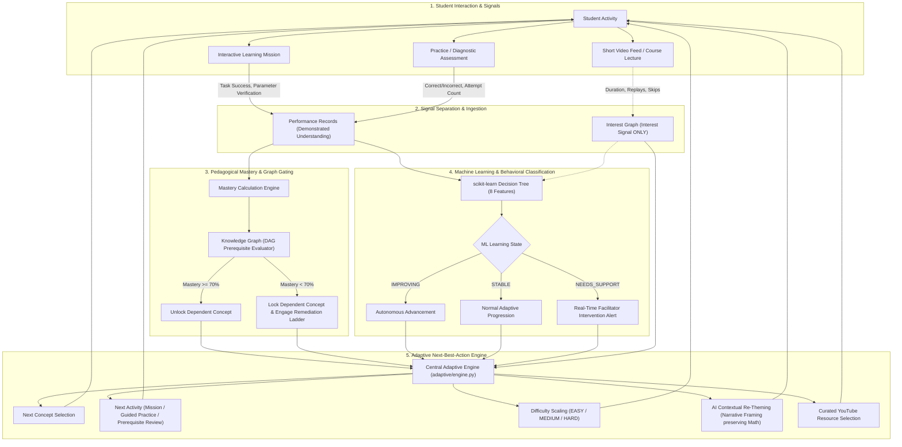

# AdaptiveLearn AI — System Architecture & Data Flow

> **“One platform. Shared knowledge. Personalized learning. Connected learners.”**

AdaptiveLearn AI is an educational platform architected around a continuous closed-loop adaptive learning engine. Rather than functioning as a passive content repository or a generic Learning Management System (LMS), AdaptiveLearn AI continuously measures demonstrated competence, maps cognitive prerequisites via a Directed Acyclic Graph (DAG), tracks multi-signal interest metrics, and triggers machine learning state evaluations to scaffold struggling students and accelerate mastering students.

---

## 1. High-Level Closed-Loop Architecture

---

## 2. Core Architectural Pillars

### A. Separation of Mastery and Engagement
In traditional platforms, watching a video or clicking "mark complete" marks a topic as completed. In **AdaptiveLearn AI**:
* **Video Engagement is strictly an INTEREST signal**: Used solely to gauge topic affinity, generate interest graph percentages, and contextualize learning narratives.
* **Mastery is strictly an ACADEMIC DEMONSTRATION signal**: Only verified answers on practice, assessments, and multi-step interactive missions update mastery scores.

### B. Prerequisite-Gated Knowledge Graph (DAG)
The knowledge graph organizes concepts into a strict Directed Acyclic Graph where:
$$\text{Status}(\text{Concept}_k) = \begin{cases} 
\text{LOCKED}, & \text{if } \exists p \in \text{Prerequisites}(\text{Concept}_k) \text{ s.t. } \text{Mastery}(p) < 70\% \\ 
\text{MASTERED}, & \text{if } \text{Mastery}(\text{Concept}_k) \ge 70\% \\ 
\text{STRUGGLING}, & \text{if } \text{Mastery}(\text{Concept}_k) < 40\% \text{ and Attempts} \ge 2 \\ 
\text{NEEDS\_PRACTICE}, & \text{if } 40\% \le \text{Mastery}(\text{Concept}_k) < 70\% \\ 
\text{LEARNING}, & \text{otherwise} 
\end{cases}$$

### C. The 5-Step Remediation Ladder
When a student repeatedly struggles on a concept:
1. **Prerequisite Concept Review**: Target the immediate parent node in the DAG.
2. **Beginner Conceptual Video**: Curated resource focused on intuitive first principles (e.g. *"Why do we square differences in variance?"*).
3. **Interactive Guided Mission**: Step-by-step scenario with parameter verification.
4. **Scaffolded Easy & Medium Practice**: Confidence-building exercises.
5. **Reassessment**: Dynamic checkpoint to cross the 70% threshold.

### D. scikit-learn Decision Tree Learning State Model
The ML component is not a black-box heuristic; it evaluates an 8-dimensional feature vector:
1. `assessment_score` (0.0 – 1.0)
2. `practice_score` (0.0 – 1.0)
3. `attempts_count` (integer)
4. `failed_attempts` (integer)
5. `previous_mastery` (0.0 – 1.0)
6. `performance_trend` (-1.0 to +1.0)
7. `video_engagement_score` (0.0 – 1.0)
8. `time_between_attempts_hours` (float)

**Target Labels**:
* `IMPROVING`: Upward trajectory, fast learning, eligible for accelerated challenges.
* `STABLE`: Steady comprehension, normal difficulty progression.
* `NEEDS_SUPPORT`: Low scores, repeated errors, declining trend; immediately dispatches actionable recommendations to the Facilitator Intervention Console.

### E. AI Contextual Re-Theming Engine
* Uses Gemini AI with backend-only keys (and robust deterministic fallbacks in Demo Mode).
* Applies strict mathematical preservation:
  * Numbers, variables, equations, constraints, and solutions are 100% frozen.
  * Only narrative themes (e.g. Space Station, Robotics Warehouse, Ocean Ecology) are transformed to match the student's highest interest graph nodes.

### F. Interactive Academic Missions (Learn-By-Doing)
* Multi-step mission scenarios (`Save the Space Station`, `Build a Sustainable Ecosystem`, `Repair the Robot`, `Land the Spacecraft`).
* **Zero manual check-offs**: The platform validates student calculations and actions step-by-step before granting completion.

---

## 3. Database Schema Overview

The database uses **MySQL** (with automated zero-config fallback to **SQLite**):

| Domain | Core Tables |
| :--- | :--- |
| **Authentication & Users** | `users`, `schools`, `grades`, `streams`, `students`, `facilitators`, `enrollments` |
| **Interests & Profiles** | `interests`, `student_interests`, `career_paths`, `career_skills` |
| **Curriculum & Knowledge DAG**| `courses`, `concepts`, `concept_prerequisites`, `student_mastery` |
| **Assessment & Practice** | `questions`, `question_attempts`, `learning_activities` |
| **Interactive Missions** | `learning_missions`, `mission_steps`, `mission_attempts` |
| **Machine Learning & Alerting**| `ml_predictions`, `interventions`, `facilitator_actions` |
| **Video & Engagement** | `youtube_playlists`, `youtube_videos`, `playlist_videos`, `playlist_concepts`, `student_playlist_recommendations`, `student_video_progress`, `video_view_history` |
| **Collaborative Community** | `communities`, `community_members`, `community_posts`, `community_comments`, `post_reactions`, `post_reports`, `study_groups`, `study_group_members`, `projects`, `project_members`, `project_tasks`, `project_milestones`, `challenges`, `challenge_participants` |
| **Productivity & Chat** | `timetables`, `timetable_sessions`, `chat_messages` |

---

## 4. Security & Safety

1. **Backend-Only API Keys**: API keys (`GEMINI_API_KEY`, `YOUTUBE_API_KEY`) reside exclusively in `.env` and are never serialized to client HTML/JS.
2. **Demo Mode Parity**: Every feature functions 100% deterministically and offline if API keys are omitted or network fails.
3. **Data Isolation**: Multi-tenant database schema ensures Student A's progress never pollutes Student B's mastery records.
4. **Defensive Error Handling**: Safe generic error messages prevent leakage of SQL exceptions or internal stack traces.
